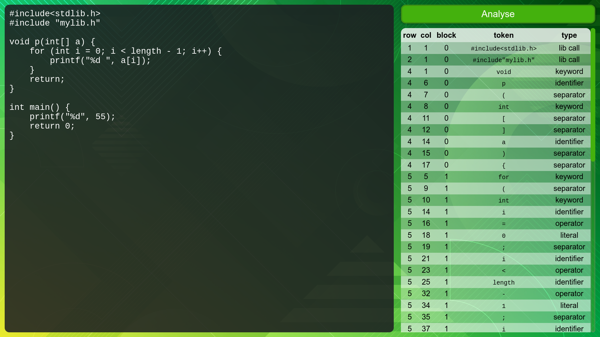
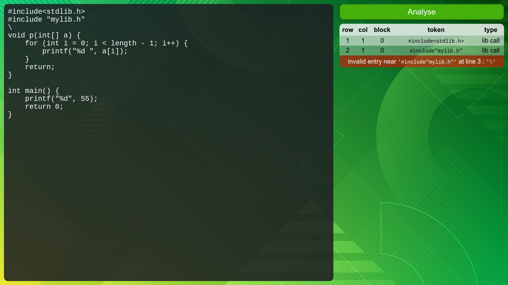

# C Lexical Analyzer

This was my project for compiler lesson (developed in Dec 2020). It's a program for analyzing `C` progrmming language tokens and extract their type.

All analyzing code is inside of the `src/lexicalAnalyzer.js` file.

It's a react application and you can see it's gui by strting the project.

**This is JUST a lexical analyser and NOT a compiler or code validator**. It just extracts the tokens and show their type, col, row, block.

## Project Start guide

1. install node.js
2. run `npm install` inside of the root directory.
3. run `npm start` inside of the root directory.

And then open the `http://localhost:3000` in your browser to see the app.

To stop running the app, press `Ctrl + c` in the terminal.

## Screenshots

